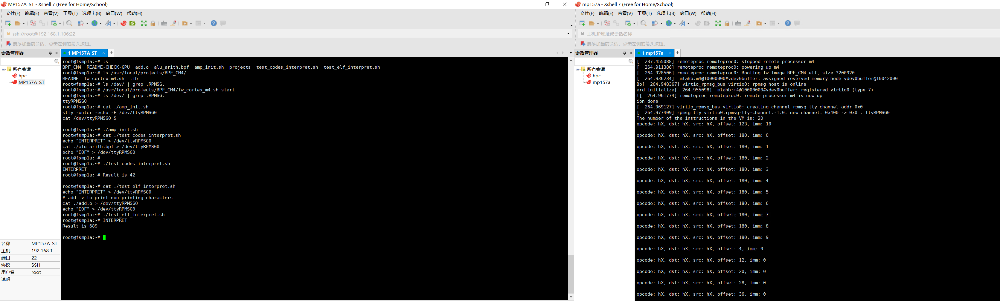

# ieBPF Cortex-A7

首先需要在 SD 卡上安装 Ubuntu 18.04，参考华清远见提供的 SD 卡上的镜像烧写教程即可。他们提供的镜像默认的用户是 `linux`，密码是`1`。

安好后，在实验上会有一些注意点，可以参考我之前记录的相关笔记，我把实践中的问题放在最上面一小节了。

[STM32MP157A和IPCC](https://forsworns.github.io/zh/blogs/20210223/)

## 测试样例 

该目录下文件放置于 A7 上的 linux 目录下

- `alu_arith.bpf` 是用 uBPF 里提供的汇编器程序，把汇编转到 BPF 的指令集上的机器码
- `add.o` 是一个真实的由 clang 编译出的 elf 文件

前者使用 `test_code_interpret.sh` 进行测试，后者使用 `test_elf_interpret.sh` 进行测试。前者可以通过测试，返回一个计算值 `42`；后者有536字节，大于 buffer 大小，被拆开成了两个（496字节+40字节），所以暂时没法通过测试，需要修改 M4 上的代码。

都需要提前将`./BPF_CM4/lib/firmware/BPF_CM4.elf` 中的 elf 映像用`./BPF_CM4/fw_cortex_m4.sh start`写入到 Cortex-M4 上，并使用 `amp_init.sh` 初始化

运行后效果如下图

